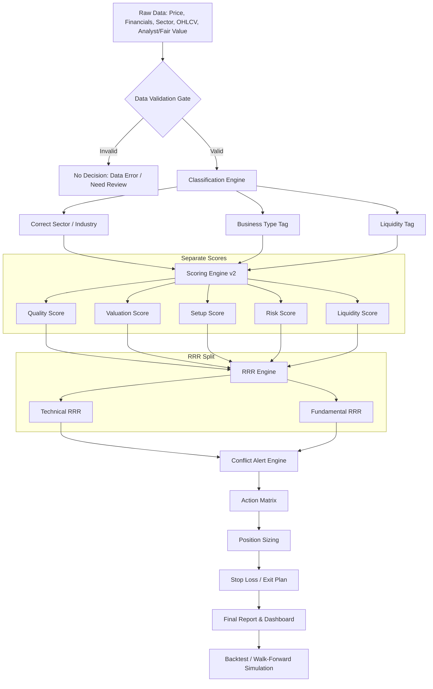

# Think2.md — Elite Stock Analysis Logic v2

> Purpose: เอกสารนี้คือ **AI Developer Specification** สำหรับปรับปรุงโปรแกรมวิเคราะห์หุ้น จากระบบเดิม `think.md` ให้แข็งขึ้น ปลอดภัยขึ้น และลดโอกาสที่ AI/โปรแกรมจะตีความผิดว่า “หุ้นลงเยอะ = หุ้นดี”
>
> Core Upgrade: แยก **คุณภาพหุ้น (Quality)** ออกจาก **ความถูกแพง (Valuation)** ออกจาก **จังหวะราคา (Setup/Timing)** และเพิ่มระบบ **Data Validation + Conflict Alert** ก่อนตัดสินใจ

---

## 0. Core Philosophy

ระบบนี้ไม่ควรถูกออกแบบให้ตอบแค่ว่า “หุ้นไหนคะแนนสูงสุด” แต่ต้องตอบให้ได้ว่า:

1. หุ้นนี้ **ธุรกิจดีจริงไหม**
2. หุ้นนี้ **ถูกจริง หรือถูกเพราะพื้นฐานแย่ลง**
3. หุ้นนี้ **จังหวะเข้าดีไหม**
4. หุ้นนี้ **reward คุ้ม risk จากทั้งมุม technical และ fundamental หรือไม่**
5. มี **data error / sector mismatch / valuation trap / dividend trap / falling knife** หรือไม่

**หลักสำคัญ:**

```text
High Upside ≠ Good Stock
Low P/E ≠ Cheap Stock
Low RSI ≠ Buy Signal
52W Low ≠ Safe Entry
52W High ≠ Fair Value
Total Score ≠ Investment Decision
```

ระบบต้องคิดแบบมืออาชีพ: **แยกเหตุผลก่อน แล้วค่อยสรุป action**

---

## 1. System Logic Flowchart v2



---

## 2. Data Validation Gate — ด่านบังคับก่อนให้คะแนน

ห้าม scoring ถ้าข้อมูลยังไม่น่าเชื่อถือ

### 2.1 Required Fields

โปรแกรมต้องตรวจว่ามีข้อมูลขั้นต่ำนี้:

| Field | Required | Reason |
|---|---:|---|
| Symbol | Yes | ระบุตัวหุ้น |
| Sector / Industry | Yes | ใช้เทียบ sector-relative |
| Price | Yes | ใช้คำนวณ upside/RRR |
| 52W High / 52W Low | Yes | ใช้ technical zone |
| PE | Yes | valuation |
| ROE | Yes | quality |
| D/E | Yes | financial risk |
| RSI | Yes | timing |
| Volume / Avg Volume | Preferred | liquidity + confirmation |
| EPS / Net Profit Growth | Preferred | ตรวจ value trap |
| Dividend Yield / Payout | Preferred | ตรวจ dividend trap |
| Analyst Target / Fair Value | Preferred | fundamental upside |

### 2.2 Hard Validation Rules

```text
IF sector is missing:
    sector_relative_score = NULL
    final_action = "REVIEW_REQUIRED"

IF sector mismatch detected:
    flag = "SECTOR_MISMATCH"
    do not compare with wrong sector benchmark

IF D/E < 0 OR D/E > 5:
    flag = "POSSIBLE_DATA_ERROR_OR_SPECIAL_CASE"
    require review before scoring

IF PE <= 0:
    valuation_score must not treat it as cheap
    flag = "LOSS_MAKING_OR_ABNORMAL_EARNINGS"

IF dividend_yield is high but payout_ratio > 100%:
    flag = "DIVIDEND_TRAP_RISK"

IF volume is too low:
    flag = "LOW_LIQUIDITY_RISK"
    reduce setup score and position size
```

### 2.3 Sector Mismatch Example

ถ้าหุ้นเป็นธุรกิจยา/commerce/distribution แต่ถูกนำไปเทียบกับ hospital operator ทั้งกลุ่ม โปรแกรมต้อง flag ทันที

```text
Example:
MEGA = Services / Commerce / Consumer health & pharmaceutical distribution
BDMS/BH/CHG/BCH/PR9 = Healthcare / Hospital operators
Therefore MEGA must not be compared directly against hospital-sector averages unless using custom peer group.
```

---

## 3. Replace Single Total Score with Score Matrix

ระบบเดิมใช้ Total Score 100% ได้ แต่ห้ามใช้เป็น decision หลักเพียงตัวเดียว

ระบบใหม่ต้องแยกคะแนนเป็น 5 ส่วน:

| Score | Weight | Meaning |
|---|---:|---|
| Quality Score | 35% | ธุรกิจดีจริงไหม |
| Valuation Score | 25% | ราคาถูกหรือแพงเทียบพื้นฐาน |
| Setup Score | 15% | จังหวะเข้า/technical ดีไหม |
| Balance Sheet Risk Score | 15% | หนี้และความเสี่ยงทางการเงิน |
| Liquidity / Volume Score | 10% | สภาพคล่องและแรงยืนยัน |

Final Composite Score คำนวณได้ แต่ต้องใช้คู่กับ action matrix เสมอ

```text
Composite Score =
    Quality * 0.35 +
    Valuation * 0.25 +
    Setup * 0.15 +
    Risk * 0.15 +
    Liquidity * 0.10
```

**ห้ามแปลว่า Composite Score สูง = ซื้อทันที**

---

## 4. Quality Score — คุณภาพธุรกิจ

Quality Score ต้องวัดคุณภาพจริง ไม่ใช่ราคาถูก

### 4.1 Metrics

| Metric | Direction | Notes |
|---|---|---|
| ROE | Higher better | แต่ต้องดูเสถียรภาพ ไม่ใช่ปีเดียว |
| ROIC | Higher better | ถ้ามีข้อมูล ควรดีกว่า ROE |
| Net Profit Growth | Higher/stable better | ตรวจว่ากำไรโตจริงไหม |
| Revenue Growth | Higher/stable better | ตรวจ demand |
| Margin Stability | Stable better | ลดหุ้นกำไรเหวี่ยง |
| Operating Cash Flow | Positive better | กันกำไรบัญชีหลอก |
| Competitive Position | Qualitative | brand/network/pricing power |

### 4.2 ROE Scoring

```text
ROE >= 20%     => Excellent
ROE 15-20%     => Strong
ROE 12-15%     => Good
ROE 8-12%      => Average
ROE < 8%       => Weak
```

### 4.3 Quality Labels

```text
Quality Score >= 80 => High Quality
65-79               => Good Quality
50-64               => Average Quality
< 50                => Weak Quality
```

---

## 5. Valuation Score — ถูกจริงหรือถูกหลอก

Valuation ต้องไม่ใช้ P/E ต่ำแบบโง่ ๆ ต้องเทียบหลายมิติ

### 5.1 Valuation Inputs

| Metric | Use |
|---|---|
| P/E vs Sector Median | เทียบกลุ่มเดียวกัน |
| P/E vs Own 5Y Average | เทียบอดีตตัวเอง |
| P/BV vs ROE | ดูว่าราคาเหมาะกับคุณภาพไหม |
| EV/EBITDA | ใช้กับธุรกิจที่ capex/debt สำคัญ |
| Dividend Yield | ใช้ได้เฉพาะถ้าปันผลยั่งยืน |
| Earnings Growth | P/E ต่ำแต่กำไรหด = ไม่ถูก |

### 5.2 PE Interpretation Rules

```text
IF PE is low AND ROE stable/growing AND earnings stable/growing:
    valuation = potentially cheap

IF PE is low AND ROE falling AND earnings falling:
    valuation = possible value trap

IF PE is high AND ROE high AND growth strong:
    valuation may still be fair

IF PE is high AND growth weak:
    valuation = expensive
```

### 5.3 Dividend Trap Detection

```text
IF dividend_yield > sector_average AND payout_ratio > 80%:
    flag = "HIGH_YIELD_REVIEW"

IF dividend_yield high AND earnings declining:
    flag = "DIVIDEND_TRAP_RISK"

IF dividend_yield high AND free_cash_flow weak:
    flag = "DIVIDEND_UNSUSTAINABLE_RISK"
```

---

## 6. Setup Score — จังหวะราคาและ technical

Setup Score ใช้เพื่อ timing เท่านั้น ไม่ใช่เหตุผลหลักในการซื้อ

### 6.1 RSI Rules

ระบบเดิมตีความ RSI ต่ำเป็นจังหวะซื้อได้ แต่ระบบใหม่ต้องใช้ร่วมกับ trend และ fundamentals

```text
RSI < 35:
    IF Quality high AND earnings stable AND price near support:
        setup = attractive pullback
    ELSE IF trend bearish OR earnings falling:
        setup = falling knife risk

RSI 35-55:
    neutral / accumulation zone

RSI 55-70:
    momentum positive but avoid chasing near resistance

RSI > 70:
    overbought risk; do not initiate large position
```

### 6.2 Price Position

```text
price_position = (current_price - low_52w) / (high_52w - low_52w)
```

Interpretation:

| Price Position | Meaning |
|---:|---|
| 0.00 - 0.20 | Near 52W low; possible value or value trap |
| 0.20 - 0.40 | Lower range; watch for accumulation |
| 0.40 - 0.60 | Mid range; neutral |
| 0.60 - 0.80 | Upper range; trend-following only |
| 0.80 - 1.00 | Near 52W high; avoid new buy unless breakout confirmed |

### 6.3 52W Low Rule Upgrade

เดิม:

```text
Entry Zone = 52W Low ถึง 52W Low + 5%
```

ใหม่:

```text
Technical Entry Zone = 52W Low ถึง 52W Low + 5%
```

แต่ต้องผ่านเงื่อนไขเพิ่ม:

```text
Can Buy near 52W Low only if:
    Quality Score >= 65
    AND earnings trend is not deteriorating
    AND no major data/conflict alert
    AND liquidity is acceptable
    AND fundamental upside exists
```

ถ้าไม่ผ่าน ให้ label เป็น:

```text
"Cheap-looking but unconfirmed"
"Falling knife risk"
"Rebound trade only"
```

---

## 7. Smart Price Zones v2

### 7.1 Technical Zones

ใช้ 52W High/Low เป็น technical reference เท่านั้น

```text
Technical Entry Zone = Low_52W to Low_52W * 1.05
Technical Exit Zone  = High_52W * 0.97 to High_52W
Technical Stop Loss  = Low_52W * 0.95
```

### 7.2 Fundamental Zones

ควรเพิ่ม target จาก valuation/fundamental

เรียงความน่าเชื่อถือของ target:

1. Normalized EPS × Fair P/E
2. Analyst Consensus Target
3. Historical Average P/E/P/BV
4. Peer-relative valuation
5. 52W High/Low
6. Chart resistance/support

### 7.3 Fundamental Target Formula

```text
normalized_eps = average(EPS over 3-5 years adjusted for abnormal items)
fair_pe = median_PE_of_peer_group adjusted by ROE/growth quality
fundamental_target = normalized_eps * fair_pe
```

ถ้าไม่มี normalized EPS ให้ใช้ analyst consensus target ชั่วคราว แต่ต้อง flag source

---

## 8. RRR Engine v2 — แยก Technical RRR และ Fundamental RRR

### 8.1 Technical RRR

```text
technical_reward = technical_exit_price - current_price
technical_risk   = current_price - technical_stop_loss
technical_rrr    = technical_reward / technical_risk
```

### 8.2 Fundamental RRR

```text
fundamental_reward = fundamental_target - current_price
fundamental_risk   = current_price - invalidation_price
fundamental_rrr    = fundamental_reward / fundamental_risk
```

### 8.3 RRR Interpretation

| RRR Pattern | Meaning | Action |
|---|---|---|
| Technical RRR high + Fundamental RRR high | Strong opportunity | Candidate for buy/accumulate |
| Technical RRR high + Fundamental RRR low | Rebound only | Small position / trade only |
| Technical RRR low + Quality high | Good stock, bad entry | Wait |
| Both RRR low | Not worth risk | Avoid / hold only |

### 8.4 Minimum RRR Rules

```text
For investment buy:
    fundamental_rrr >= 2.0
    AND quality_score >= 65

For tactical trade:
    technical_rrr >= 2.0
    AND position_size reduced
    AND strict stop loss

For no trade:
    rrr < 1.5
```

---

## 9. Conflict Alert Engine

นี่คือหัวใจของระบบใหม่ ต้องแสดงเตือนชัด ๆ ไม่ให้ AI สรุปมั่ว

| Conflict | Condition | Meaning | Action |
|---|---|---|---|
| Sector Mismatch | sector/peer group wrong | เทียบผิดกลุ่ม | No decision until fixed |
| Data Error | abnormal D/E, PE, missing data | ข้อมูลอาจผิด | Review required |
| High RRR / Low Quality | RRR > 2 but Quality < 50 | ถูกแต่เสี่ยง | Rebound only / avoid |
| High Quality / Low RRR | Quality > 75 but RRR < 1.5 | หุ้นดีแต่จังหวะไม่คุ้ม | Wait |
| Oversold Bearish | RSI < 35 + bearish trend | falling knife | Avoid averaging |
| Low PE Falling ROE | PE low + ROE declining | value trap | Avoid until earnings stabilize |
| High Yield Falling Earnings | yield high + profit decline | dividend trap | Do not buy for yield only |
| Near 52W High | price_position > 0.85 | upside limited | avoid new large entry |
| Low Liquidity | low avg volume | slippage risk | reduce position size |

### 9.1 Conflict Severity

```text
RED    = must not buy until resolved
ORANGE = buy only with reduced position / review
YELLOW = caution, monitor
GREEN  = no major conflict
```

---

## 10. Action Matrix

ระบบต้องใช้ matrix ไม่ใช่ Total Score อย่างเดียว

| Quality | Valuation | Setup | RRR | Action |
|---|---|---|---|---|
| High | Cheap/Fair | Good | Good | BUY / ACCUMULATE |
| High | Expensive | Good | Low | WAIT / WATCHLIST |
| High | Cheap | Bad | Good | WAIT FOR SETUP |
| Average | Cheap | Good | Good | SMALL BUY / SPECULATIVE |
| Low | Cheap | Good | High | REBOUND TRADE ONLY |
| Low | Expensive | Bad | Low | AVOID |
| Any | Any | Any | Any + RED conflict | NO DECISION / REVIEW |

### 10.1 Recommended Action Labels

Use only these labels:

```text
STRONG_BUY_CANDIDATE
BUY_CANDIDATE
ACCUMULATE_SMALL
WAIT_FOR_ENTRY
WATCHLIST_ONLY
HOLD
TAKE_PROFIT_PARTIAL
REDUCE
EXIT
REBOUND_TRADE_ONLY
AVOID
REVIEW_REQUIRED
DATA_ERROR_NO_DECISION
```

---

## 11. Position Sizing Rules

ระบบต้องไม่ให้ action โดยไม่กำหนดขนาดไม้

### 11.1 Base Position Size

| Setup | Position Size |
|---|---:|
| Strong buy candidate | 10-15% max portfolio |
| Buy candidate | 5-10% |
| Accumulate small | 3-5% |
| Rebound trade only | 1-3% |
| Review required | 0% |
| Avoid | 0% |

### 11.2 Risk-Based Position Size

```text
risk_budget_per_trade = portfolio_value * 0.01  # max 1% loss per idea
risk_per_share = current_price - stop_loss
shares = risk_budget_per_trade / risk_per_share
position_value = shares * current_price
```

Hard caps:

```text
single_stock_max = 15-20% of portfolio
cash_reserve_min = 20-30%
max_positions = 5-8 stocks
```

### 11.3 Averaging Down Rules

```text
IF stock is red AND Quality Score > 70 AND inside Entry Zone AND no RED conflict:
    smart_average_allowed = True

IF stock is red AND Quality Score < 50:
    smart_average_allowed = False
    prepare reduce/exit

IF stock is red AND price not in Entry Zone:
    wait; do not average

IF stock has falling earnings or value trap alert:
    no averaging down
```

---

## 12. Stop Loss / Exit Rules

### 12.1 Stop Loss Types

| Stop Type | Formula | Use |
|---|---|---|
| Technical SL | 52W Low × 0.95 | simple support break |
| Volatility SL | Entry - 2×ATR | better for volatile stocks |
| Fundamental SL | thesis broken | earnings/sector/quality deterioration |

### 12.2 Exit Rules

```text
TAKE_PROFIT_PARTIAL:
    sell 30-50% when price reaches technical exit zone

FULL_EXIT:
    sell 100% if stop loss hit
    OR fundamental thesis broken
    OR major red conflict appears

REDUCE:
    if price reaches near target but valuation becomes stretched
```

### 12.3 Recovery Awareness

```text
loss_10_percent requires +11.1% to recover
loss_20_percent requires +25.0% to recover
loss_30_percent requires +42.9% to recover
loss_50_percent requires +100.0% to recover
```

ระบบควรแสดง Recovery % ทุกครั้งที่แนะนำถือหุ้นที่ขาดทุน

---

## 13. Trend & Volume Logic

### 13.1 Trend Status

| Trend | Condition | Meaning |
|---|---|---|
| Bullish | RSI > 55 and price_position > 0.50 | momentum positive |
| Bearish | RSI < 45 and price_position < 0.40 | downtrend risk |
| Sideways | RSI 45-55 and price_position mid-range | wait for direction |
| Weak Trend | indicators conflict | avoid aggressive entry |

### 13.2 Volume Spike

```text
volume_ratio = current_volume / average_volume_20d
```

| Volume Ratio | Meaning |
|---:|---|
| > 2.0 | strong activity; possible smart money or panic |
| 1.2 - 2.0 | above average |
| 0.8 - 1.2 | normal |
| < 0.8 | weak confirmation |

Important:

```text
Volume spike is not automatically bullish.
If price down + volume spike = distribution/panic risk.
If price up + volume spike + breakout = accumulation/momentum confirmation.
```

---

## 14. Sector Benchmarking 2.0

### 14.1 Peer Group Must Be Correct

Sector-relative scoring must compare only similar business models

Examples:

```text
Hospital Operators:
BDMS, BH, BCH, CHG, PR9

Pharma / Consumer Health / Distribution:
MEGA and similar peers
```

ห้ามเอา hospital operator ไปเทียบกับ commerce/pharma/distribution แบบตรง ๆ

### 14.2 Quality vs Price Matrix

ระบบควรสร้าง matrix:

| Quadrant | Meaning | Action |
|---|---|---|
| High Quality + Cheap | เพชรในตม | buy candidate |
| High Quality + Expensive | หุ้นดีแต่แพง | wait |
| Low Quality + Cheap | value trap/rebound | caution |
| Low Quality + Expensive | แย่ทั้งคู่ | avoid |

### 14.3 Relative Metrics

| Metric | Compare Against |
|---|---|
| PE | sector median + own history |
| ROE | sector median |
| D/E | sector median and absolute threshold |
| Yield | sector median + payout sustainability |
| Margin | sector peers |

---

## 15. Example Interpretation Rules for Healthcare Group

### 15.1 Hospital Operators

Hospital stocks should consider:

| Factor | Why it matters |
|---|---|
| Patient volume | revenue driver |
| Revenue per patient | pricing power |
| Medical tourism exposure | upside + macro risk |
| Social security exposure | margin sensitivity |
| Network size | moat and referral power |
| Specialty center strength | premium pricing |
| Bed utilization | operating leverage |
| Doctor/staff cost | margin pressure |

### 15.2 Example Labels

```text
BDMS:
    likely core quality / defensive healthcare network

BH:
    premium quality / high ROE / medical tourism sensitivity

PR9:
    value/setup candidate but smaller scale

CHG:
    value/rebound candidate; watch profitability trend

BCH:
    high technical upside possible but must check quality/growth; rebound trade if quality weak

MEGA:
    separate peer group; do not compare directly with hospital operators
```

---

## 16. Backtesting v2

Backtest must be walk-forward and avoid look-ahead bias

### 16.1 Required Backtest Rules

```text
For each historical day:
    calculate 52W high/low using only past data
    calculate RSI using only past data
    calculate score using only data available at that date
    make buy/sell decision
    record trade, cash, position, portfolio value
```

### 16.2 Strategy Rules

```text
BUY:
    if action in [STRONG_BUY_CANDIDATE, BUY_CANDIDATE, ACCUMULATE_SMALL]
    and cash available
    and position cap not exceeded
    and no RED conflict

TAKE PROFIT:
    sell 30-50% when price reaches exit zone or target

STOP LOSS:
    sell 100% when price breaks stop

RE-ENTRY:
    allow buy again only if new signal appears after cooldown or reset condition
```

### 16.3 Performance Metrics

| Metric | Purpose |
|---|---|
| CAGR | annual return |
| Max Drawdown | pain level |
| Sharpe Ratio | risk-adjusted return |
| Win Rate | trade accuracy |
| Average Win / Average Loss | payoff ratio |
| Exposure % | time in market |
| Turnover | trading frequency |
| Strategy vs Buy & Hold | prove value |

### 16.4 Must Compare

```text
Strategy Value vs Buy & Hold Value
Strategy Drawdown vs Buy & Hold Drawdown
Strategy Return per Max Drawdown
```

ถ้า strategy ชนะ return แต่ drawdown หนักกว่า ต้อง flag ว่า risk-adjusted อาจไม่ดี

---

## 17. Dashboard Requirements

### 17.1 Main Output Per Stock

ต้องแสดง:

```text
Symbol
Business Description
Correct Sector / Peer Group
Price
Quality Score
Valuation Score
Setup Score
Risk Score
Liquidity Score
Composite Score
Technical RRR
Fundamental RRR
Upside % Technical
Upside % Fundamental
Trend Status
Conflict Alerts
Recommended Action
Position Size
Stop Loss
Take Profit Zone
Rationale
```

### 17.2 Color Rules

| Color | Meaning |
|---|---|
| Green | strong / valid opportunity |
| Yellow | watch / caution |
| Orange | conflict / reduced size |
| Red | avoid / no decision |
| Gray | insufficient data |

### 17.3 Dashboard Must Not Hide Conflicts

ถ้าหุ้นมี Composite Score สูง แต่มี RED conflict ต้องแสดง:

```text
High score detected, but decision blocked due to RED conflict: [reason]
```

---

## 18. Report Template

### 18.1 Short Summary Format

```text
[Symbol] — [Action]
Business: ...
Quality: ...
Valuation: ...
Setup: ...
RRR: Technical x.xx / Fundamental x.xx
Conflicts: ...
Position Size: ...
Stop Loss: ...
Reason: ...
```

### 18.2 Rationale Rules

Rationale must be evidence-based:

Bad:

```text
Cheap, good upside, buy
```

Good:

```text
Quality is strong due to ROE above sector median and low D/E. Valuation appears fair, but setup is not ideal because price is near upper 52W range. Action: wait for pullback rather than chase.
```

---

## 19. AI Developer Implementation Prompt

Use this prompt when asking AI to modify the program:

> You are a Python quant/developer helping build a stock analysis system. Read `Think2.md` carefully and refactor the program according to this specification.
>
> Main requirements:
>
> 1. Do not rely on a single Total Score for buy/sell decisions.
> 2. Split scoring into Quality, Valuation, Setup, Balance Sheet Risk, and Liquidity.
> 3. Add a Data Validation Gate before scoring.
> 4. Add sector/peer-group validation so wrong sector comparisons are blocked.
> 5. Separate Technical RRR from Fundamental RRR.
> 6. Treat 52W Low/High as technical reference only, not fair value.
> 7. Add Conflict Alerts such as sector mismatch, value trap, falling knife, dividend trap, high RRR/low quality, and data error.
> 8. Use an Action Matrix instead of score-only ranking.
> 9. Add risk-based position sizing and cash reserve logic.
> 10. Update dashboard output to show conflicts and block buy decisions when RED conflicts exist.
>
> Preserve the original safety logic from `think.md`, especially position sizing, stop loss, recovery awareness, cash reserve, and walk-forward backtesting, but upgrade the decision engine using `Think2.md`.

---

## 20. Implementation Checklist

### Phase 1 — Data Layer

- [ ] Validate required fields
- [ ] Detect missing/invalid values
- [ ] Detect abnormal D/E / PE / yield
- [ ] Add correct sector and peer group mapping
- [ ] Add data status: VALID / REVIEW_REQUIRED / INVALID

### Phase 2 — Scoring Layer

- [ ] Build Quality Score
- [ ] Build Valuation Score
- [ ] Build Setup Score
- [ ] Build Risk Score
- [ ] Build Liquidity Score
- [ ] Build Composite Score but do not use alone

### Phase 3 — RRR Layer

- [ ] Technical RRR from 52W high/low / chart zones
- [ ] Fundamental RRR from fair value / analyst target / normalized EPS
- [ ] Add RRR interpretation label

### Phase 4 — Conflict Engine

- [ ] Sector mismatch
- [ ] Data error
- [ ] High RRR / Low Quality
- [ ] High Quality / Low RRR
- [ ] Oversold + bearish trend
- [ ] Low PE + falling ROE
- [ ] High yield + falling earnings
- [ ] Low liquidity

### Phase 5 — Action Engine

- [ ] Implement action matrix
- [ ] Add position sizing
- [ ] Add stop loss / take profit
- [ ] Add recovery percentage
- [ ] Block buy when RED conflict exists

### Phase 6 — Backtest

- [ ] Walk-forward OHLCV
- [ ] Avoid look-ahead bias
- [ ] Compare strategy vs buy & hold
- [ ] Track CAGR, max drawdown, Sharpe, win rate, payoff ratio

---

## 21. Final Rules for AI / Program

```text
1. Never say BUY only because Total Score > 70.
2. Never say BUY only because RRR > 2.
3. Never say BUY only because price is near 52W low.
4. Never say BUY only because RSI is oversold.
5. Never compare stocks across wrong sectors without warning.
6. Always show conflicts before action.
7. Always separate quality from timing.
8. Always separate technical upside from fundamental upside.
9. Always size position based on risk.
10. If data is wrong, output REVIEW_REQUIRED, not fake confidence.
```

---

## 22. Recommended Final Output Schema

```json
{
  "symbol": "BDMS",
  "business_description": "Hospital operator / healthcare network",
  "sector": "Healthcare",
  "peer_group": "Hospital Operators",
  "data_status": "VALID",
  "scores": {
    "quality": 82,
    "valuation": 70,
    "setup": 65,
    "risk": 90,
    "liquidity": 85,
    "composite": 78
  },
  "rrr": {
    "technical_rrr": 2.1,
    "fundamental_rrr": 1.8,
    "interpretation": "Good quality, but fundamental RRR slightly below ideal"
  },
  "trend": "Sideways / Accumulation",
  "conflicts": [
    {
      "severity": "YELLOW",
      "type": "RRR_CAUTION",
      "message": "Fundamental RRR below 2.0"
    }
  ],
  "action": "WAIT_FOR_ENTRY",
  "position_size_percent": 0,
  "stop_loss": 0,
  "take_profit_zone": [0, 0],
  "rationale": "High quality hospital operator, but current reward/risk does not justify aggressive entry. Wait for better price or improved fundamental upside."
}
```

---

## 23. Summary

Think2 upgrades the original system from:

```text
Score high + Entry Zone + RRR high => likely buy
```

into:

```text
Valid data
+ correct sector
+ good quality
+ reasonable valuation
+ good setup
+ technical and fundamental RRR confirmed
+ no major conflict
+ proper position sizing
=> buy candidate
```

This prevents the most dangerous failure mode:

```text
A stock looks cheap because it has fallen hard, but the business quality is deteriorating.
```

The system must reward **good businesses at good prices**, not simply **falling prices with pretty upside numbers**.

