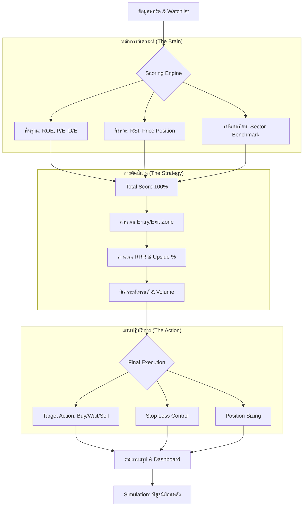

# Stock Investment Analysis Logic (หลักการวิเคราะห์หุ้น - ฉบับสมบูรณ์)

## 0. System Logic Flowchart (แผนผังสมองของระบบ)

## 1. ระบบการให้คะแนน (Multi-Factor Scoring)
ระบบใช้การถ่วงน้ำหนักเพื่อให้คะแนนเต็ม 100 (Total Score):
*   **20% Financial Risk (D/E Ratio):** หนี้ต่ำ = คะแนนสูง (เน้นความปลอดภัย)
*   **20% Timing & Technical (RSI + Price Position):** ราคาถูกและ RSI ต่ำ = คะแนนสูง
*   **30% Absolute Fundamentals (P/E, ROE, Yield):** คุณภาพกำไรและปันผล
*   **30% Sector-Relative Quality:** เปรียบเทียบตัวเลขพื้นฐานกับ "ค่ากลางของกลุ่ม" (เพื่อหาหุ้นที่เด่นที่สุดในกลุ่มนั้นๆ)

## 2. Smart Price Zones (แผนที่ราคา)
ระบบคำนวณจุดเข้า/ออกที่ได้เปรียบทางสถิติ:
*   **Entry Zone:** [Low 52W] ถึง [Low 52W + 5%] (จุดซื้อที่มีความเสี่ยงต่ำที่สุดในรอบปี)
*   **Exit Zone:** [High 52W - 3%] ถึง [High 52W] (จุดขายทำกำไรก่อนราคาจะชนเพดาน)

## 3. Volume Spike Analysis (รอยเท้าเจ้ามือ)
*   **Volume Ratio > 2.0:** มีแรงซื้อขายมากกว่าปกติ 2 เท่า เป็นสัญญาณยืนยันการไหลเข้าของเงินก้อนใหญ่ (Smart Money)
## 4. Capital Protection (การป้องกันเงินทุน)
*   **Stop Loss (SL):** [Low 52W - 5%] คือจุดที่ "ต้องขายทิ้ง" ทันทีหากราคาหลุดแนวรับสำคัญ
*   **Recovery %:** คำนวณความยากในการคืนทุน (เช่น หากขาดทุน 20% ต้องกำไรกลับมาถึง 25% ถึงจะเท่าทุน)

## 5. Trend Status Definitions (ความหมายของสถานะเทรนด์)
*   **Bullish 📈 (ขาขึ้นแข็งแกร่ง):** RSI > 55 และราคาอยู่โซนบน (>50%) มั่นใจได้ในการรันเทรนด์
*   **Bearish 📉 (ขาลงชัดเจน):** RSI < 45 และราคาอยู่โซนล่าง (<40%) เสี่ยงสูงมาก ไม่ควรเข้าซื้อ
*   **Sideways ➡️ (พักตัวเลือกทาง):** RSI อยู่ในช่วง 45-55 ราคาแกว่งตัวในกรอบแคบๆ
*   **Weak Trend ⚠️ (เทรนด์อ่อนแรง):** ทิศทางขัดแย้งกัน หรือแรงส่งไม่พอจะเลือกข้าง ให้ระวังสัญญาณหลอก

## 6. Smart Price Zones (แผนที่ราคา)
*   **Entry Zone:** [Low 52W] ถึง [Low 52W + 5%] (จุดซื้อที่ปลอดภัยที่สุด ความเสี่ยงต่ำ)
*   **Exit Zone:** [High 52W - 3%] ถึง [High 52W] (จุดขายทำกำไรก่อนที่คนส่วนใหญ่จะเริ่มเทขาย)

*   **RRR (Risk-Reward Ratio):** กำไรคาดหวัง / ความเสี่ยง (Reward / Risk)
    *   *การตีความ:* **RRR 2.0** แปลว่า ถ้าได้กำไรจะได้ 2 ส่วน แต่ถ้าขาดทุนจะเสียแค่ 1 ส่วน ยิ่งค่านี้สูงยิ่งคุ้มที่จะเสี่ยง
*   **Upside % (ระยะกำไร):** โอกาสทำกำไรจากราคาปัจจุบันถึงขอบล่างของ `Exit Zone`
    *   *เกณฑ์:* 
        *   ✅ **> 15%**: มีช่องว่างกำไรกว้าง (น่าสนใจมาก)
        *   ⏳ **5 - 15%**: ช่องว่างเริ่มแคบ (ควรถือลุ้น แต่ระวังการซื้อเพิ่ม)
        *   ⚠️ **< 5%**: กำไรเหลือพื้นที่น้อยมาก (มีความเสี่ยงที่จะชนแนวต้านและย่อตัว)

## 8. คู่มือการวิเคราะห์ (The Ultimate Analysis Guide)
... (คงเดิม) ...

เพื่อให้ผู้ใช้ตัดสินใจได้อย่างแม่นยำ ระบบใช้เกณฑ์มาตรฐานสากลดังนี้:
*   **Total Score**: ✅ > 70 คือหุ้นเกรด A พื้นฐานแกร่งกว่าตลาด
*   **ROE (กำไรต่อส่วนผู้ถือหุ้น)**: วัดความเก่งของบริษัทในการทำกำไร (✅ > 12-15% คือดีมาก)
*   **P/E (ราคาต่อกำไร)**: วัดความถูกแพงและระยะเวลาคืนทุน (ยิ่งต่ำยิ่งดี แต่ต้องเทียบในกลุ่มเดียวกัน)
*   **D/E Ratio (หนี้สิน)**: วัดความเสี่ยงทางการเงิน (🛡️ < 1.0 คือปลอดภัย, ⚠️ > 2.0 คือหนี้สูงเกินไป)
*   **RSI (Relative Strength Index)**: วัดความร้อนแรงของแรงซื้อขาย (0-100)
    *   *เกณฑ์:*
        *   🟢 **< 35 (Oversold)**: คนแย่งกันขายจนราคาถูกเกินไป (เป็นจังหวะ "ซื้อ" ที่ได้เปรียบ)
        *   ⏳ **35 - 70**: แรงซื้อขายปกติ
        *   🔴 **> 70 (Overbought)**: คนแย่งกันซื้อจนราคาแพงเกินไป (ระวังการเทขายทำกำไร)

## 8. Investment Advice Logic (ตรรกะการให้คำแนะนำ)
... (คงเดิม) ...

## 9. Dashboard Consistency (ความสอดคล้องของระบบ)
*   **Visual Standards:** ทุกหน้าต้องใช้มาตรฐานสีเดียวกัน (เขียว = จุดเข้าที่ได้เปรียบ, ทอง = จุดออกที่ควรทำกำไร, แดง = สัญญาณเตือนหรืออันตราย)
*   **Ready-to-Buy Awareness:** ในหน้า Screener หุ้นที่ผ่านเกณฑ์พื้นฐาน (Score > 70) และจังหวะราคา (Entry Zone) จะถูก Highlight สีเขียวทันที

## 10. Elite Analysis Strategy
*   **Multi-Factor Screening:** การค้นหาหุ้นใหม่ต้องกรองทั้งคุณภาพ (Score), ความคุ้มค่า (RRR > 2.0), และแนวโน้ม (Trend != Bearish)
*   **Sector Benchmarking 2.0:** การวิเคราะห์รายกลุ่มต้องระบุ "เพชรในตม" ได้ผ่านกราฟ Quality vs Price (Top-Left Zone) เพื่อหาหุ้นที่เก่งที่สุดในราคาที่ถูกที่สุดในกลุ่ม

## 11. Strategy Backtesting (การจำลองกลยุทธ์)
ระบบจำลองการลงทุนในอดีตเพื่อพิสูจน์ผลลัพธ์:
*   **Historical Data:** ใช้ข้อมูลรายวันย้อนหลัง (OHLCV) เพื่อจำลองการซื้อขายจริง
*   **Walk-Forward Simulation:** คำนวณ High/Low 52 สัปดาห์ และ RSI ในแต่ละวันเพื่อตัดสินใจแบบ Real-time (ในอดีต)
*   **Core Rules:**
    *   `BUY`: เมื่อราคาเข้า `Entry Zone` และมีเงินสด
    *   `TAKE PROFIT`: ขาย 50% เมื่อราคาแตะ `Exit Zone`
    *   `STOP LOSS`: ขาย 100% เมื่อราคาหลุดจุดหนีตาย
*   **Continuous Re-investment (การหมุนเวียนเงินทุน):**
    *   เมื่อมีการขาย (ทั้ง TP และ SL) เงินสดที่ได้รับจะถูกนำกลับมารอซื้อในรอบถัดไปทันที
    *   ระบบจะตรวจสอบเงื่อนไขการซื้อทุกวัน แม้ว่าจะเพิ่งขายไป เพื่อไม่ให้พลาดโอกาสในรอบใหม่ (Buy -> Sell -> Buy Again)
*   **Performance Comparison (การวัดผล):**
    *   **Strategy Value (มูลค่าตามระบบ):** มูลค่าพอร์ตล่าสุดที่เกิดจากการเทรดตามกฎของระบบ (มีทั้งการตั้งรับ และการขายทำกำไร/ตัดขาดทุน) เพื่อรักษาวินัยและเงินต้น
    *   **Buy & Hold Value (มูลค่าหากซื้อถือยาว):** มูลค่าพอร์ตล่าสุดหากซื้อหุ้นตั้งแต่วันแรกที่เริ่มจำลองและถือไว้เฉยๆ จนจบ โดยไม่มีการขายออกเลย (เพื่อใช้เปรียบเทียบว่าระบบช่วย "ทำกำไรได้มากกว่า" หรือ "ลดการขาดทุน" ได้ดีแค่ไหน)

## 12. Money Management Master Rules (กฎการเดินเงินระดับเซียน)
เพื่อให้ระบบสร้างผลตอบแทนที่ยั่งยืน ผู้ใช้ควรปฏิบัติตามกฎดังนี้:
*   **Non-Lump Sum Entry:** ห้ามซื้อหุ้นหมดในคราวเดียว แม้จะเป็นหุ้นเกรด A ให้แบ่งเงินลงทุนเป็น 3-4 ไม้ และเข้าซื้อตามจังหวะที่ระบบแนะนำ
*   **Loss Management Logic:**
    *   *หุ้นแดง + Score > 70 + Entry Zone:* คือโอกาส "ถัวเฉลี่ยเชิงกลยุทธ์" (Smart Average)
    *   *หุ้นแดง + Score < 50:* ห้ามถัวเพิ่มเด็ดขาด ให้เตรียมตัวหนี (Reduce/Exit)
    *   *หุ้นแดง + ราคายังไม่ถึง Entry Zone:* ให้ถือเงินสดรอ (Wait) ห้ามรีบร้อน
*   **Portfolio Health:**
    *   จำกัดจำนวนหุ้นในพอร์ตที่ 5-8 ตัวเพื่อการโฟกัสที่มีประสิทธิภาพ
    *   จำกัดสัดส่วนหุ้นรายตัวไม่เกิน 15-20% ของเงินลงทุนทั้งหมด
    *   **Cash Reserve:** คงเงินสดไว้ 20-30% เสมอ เพื่อรอ "ช้อนซื้อ" หุ้นเกรด A ในวันที่ตลาดตระหนก

## 13. AI Developer Prompt (สำหรับใช้พัฒนาต่อยอด)

> "คุณคือผู้เชี่ยวชาญ Python สาย Quant โปรเจกต์นี้ใช้ตรรกะ Sector-Relative ร่วมกับระบบบริหารความเสี่ยงระดับสถาบัน
> **กรุณาอ่าน `think.md` เพื่อทำความเข้าใจ:**
> 1. ระบบ RRR และ Position Sizing ที่อิงจากงบความเสี่ยง
> 2. การแยก 'คุณภาพหุ้น' (Score) ออกจาก 'จังหวะราคา' (Zones)
> 3. ระบบ Visual Awareness ที่ใช้สีเตือนความขัดแย้ง (Conflict Alert)
> เมื่อเข้าใจแล้ว โปรดช่วยฉัน [ระบุสิ่งที่ต้องการให้ทำ] โดยรักษาตรรกะความปลอดภัยนี้ไว้"

---
*อัปเดตล่าสุด: เมษายน 2026 (Elite Master Version)*
